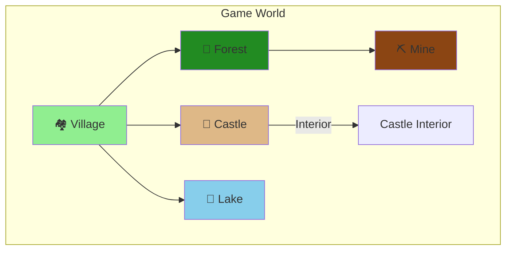

<div align="center"><a name="readme-top"></a>

# 🎮 Kaboom RPG Adventure

### A 2D Pixel-Style RPG Adventure Game

An immersive pixel-art RPG adventure game built with Kaboom.js, featuring NPC dialogues, quest systems, turn-based combat, mini-games, and multiple explorable areas.<br/>
Experience classic RPG exploration with modern web technologies.

**🌐 Language / 语言:** [English](README.md) | [中文](README_zh.md)

<br/>

<!-- SHIELD GROUP -->

[![][github-stars-shield]][github-stars-link]
[![][github-forks-shield]][github-forks-link]
[![][github-issues-shield]][github-issues-link]
[![][github-license-shield]][github-license-link]

**Tech Stack:**


</div>

## 📑 Table of Contents

- [🎮 Kaboom RPG Adventure](#-kaboom-rpg-adventure)
  - [📑 Table of Contents](#-table-of-contents)
  - [🌟 Introduction](#-introduction)
  - [✨ Key Features](#-key-features)
  - [🎬 Demo](#-demo)
  - [🛠️ Tech Stack](#️-tech-stack)
  - [🚀 Getting Started](#-getting-started)
    - [Prerequisites](#prerequisites)
    - [Installation](#installation)
    - [Development](#development)
    - [Build for Production](#build-for-production)
  - [🎮 Game Controls](#-game-controls)
  - [🗺️ Game World](#️-game-world)
  - [📁 Project Structure](#-project-structure)
  - [🎨 Customization](#-customization)
  - [🤝 Contributing](#-contributing)
  - [📄 License](#-license)
  - [👤 Author](#-author)

## 🌟 Introduction

<table>
<tr>
<td>

**Kaboom RPG Adventure** is a classic 2D pixel-style RPG game that brings back the nostalgic feel of retro adventure games while leveraging modern web technologies. Built with the powerful Kaboom.js game engine and bundled with Vite for optimal performance.

**Why This Project?**

This project demonstrates how to build a complete RPG game using web technologies, featuring:
- A fully functional quest and dialogue system
- Turn-based combat mechanics
- Mini-games for resource gathering
- Multiple interconnected map areas
- Save/Load functionality

**Goals:**
- Provide an engaging RPG experience in the browser
- Showcase modern JavaScript game development practices
- Create a modular and extensible game architecture

</td>
</tr>
</table>

> [!NOTE]
> - Node.js >= 18.0 required
> - Modern browser with ES6+ support
> - Keyboard or touch input device

## ✨ Key Features

### `1` 🗺️ Expansive Game World

Explore multiple interconnected areas including villages, castles, forests, lakes, and mines. Each area features unique NPCs, quests, and secrets to discover.

**Available Areas:**
- 🏘️ **Village** - Your starting point with shops and friendly NPCs
- 🏰 **Castle** - Meet royalty and receive important quests
- 🌲 **Forest** - Battle monsters and gather resources
- 🌊 **Lake** - Peaceful fishing spot with hidden treasures
- ⛏️ **Mine** - Mine valuable ores and face underground dangers

### `2` ⚔️ Turn-Based Combat System

Engage in strategic turn-based battles against various enemies. Level up your character, manage your health and resources, and defeat powerful bosses.

**Combat Features:**
- Strategic turn-based mechanics
- Multiple enemy types with unique behaviors
- Experience and leveling system
- Health and resource management

### `3` 🎣 Mini-Games

Take a break from adventuring with engaging mini-games:
- **Fishing** - Catch fish at the lake for gold and items
- **Mining** - Dig for valuable ores and gems in the mines

### `*` Additional Features

- [x] 💬 **NPC Dialogue System** - Rich conversations with branching dialogues
- [x] 📜 **Quest System** - Track and complete various quests
- [x] 🎒 **Inventory System** - Manage your items and equipment
- [x] 🏪 **Shop System** - Buy and sell items with merchants
- [x] 💾 **Save/Load System** - Continue your adventure anytime
- [x] 🏆 **Achievement System** - Unlock achievements for your accomplishments
- [x] 💰 **Economy System** - Earn and spend gold throughout the game
- [x] 📱 **Responsive Controls** - Support for keyboard and touch input

<div align="right">

[![][back-to-top]](#readme-top)

</div>

## 🎬 Demo

Experience the game directly in your browser! Clone the repository and run `npm run dev` to start playing.

**Game Preview:**

| Start Screen | Village Exploration |
|:---:|:---:|
| Start your adventure | Interact with NPCs |

| Combat System | Mini-Games |
|:---:|:---:|
| Strategic battles | Fishing & Mining |

## 🛠️ Tech Stack

<div align="center">
  <table>
    <tr>
      <td align="center" width="96">
        
        <br>JavaScript
      </td>
      <td align="center" width="96">
        
        <br>Vite 5
      </td>
      <td align="center" width="96">
        
        <br>HTML5
      </td>
      <td align="center" width="96">
        
        <br>CSS3
      </td>
    </tr>
  </table>
</div>

**Core Technologies:**
- **Game Engine**: Kaboom.js v3000 - A fun and fast 2D game library
- **Build Tool**: Vite v5 - Next generation frontend tooling
- **Language**: JavaScript (ES Modules)
- **Graphics**: Canvas API with pixel art sprites

**Online Resources:**
- **Kaboom Official Sprites**: `https://cdn.jsdelivr.net/gh/replit/kaboom@master/sprites/`
- **Dynamic Tiles**: Generated using Canvas API

## 🚀 Getting Started

### Prerequisites

> [!IMPORTANT]
> Ensure you have the following installed:

- Node.js 18.0+ ([Download](https://nodejs.org/))
- npm or yarn package manager
- Git ([Download](https://git-scm.com/))

### Installation

**1. Clone the Repository**

```bash
git clone https://github.com/ChanMeng666/kaboom-rpg-adventure.git
cd kaboom-rpg-adventure
```

**2. Install Dependencies**

```bash
npm install
```

### Development

```bash
npm run dev
```

Open your browser and visit `http://localhost:5173`

### Build for Production

```bash
npm run build
```

The build output will be in the `dist/` directory.

**Preview the Build:**

```bash
npm run preview
```

## 🎮 Game Controls

| Action | Key/Gesture |
|--------|-------------|
| Movement | Arrow Keys / WASD |
| Interact | Collide with NPC or object |
| Confirm Dialogue | Enter / Space / Click |
| Move to Target | Mouse Click / Touch |
| Debug Mode | F1 |

> [!TIP]
> The game supports both keyboard and touch controls, making it playable on both desktop and mobile devices.

## 🗺️ Game World

The game features multiple interconnected areas, each with unique content:



**Area Features:**

| Area | NPCs | Quests | Mini-Games | Enemies |
|------|------|--------|------------|---------|
| Village | ✅ | ✅ | ❌ | ❌ |
| Castle | ✅ | ✅ | ❌ | ❌ |
| Forest | ✅ | ✅ | ❌ | ✅ |
| Lake | ✅ | ✅ | 🎣 Fishing | ❌ |
| Mine | ✅ | ✅ | ⛏️ Mining | ✅ |

## 📁 Project Structure

```
kaboom-rpg-adventure/
├── src/
│   ├── main.js              # Main entry point
│   ├── kaboomCtx.js         # Kaboom initialization
│   ├── constants.js         # Game constants and data
│   ├── utils.js             # Utility functions
│   ├── sprites.js           # Sprite resource loading
│   ├── player.js            # Player character module
│   ├── world.js             # Game world module
│   ├── gameState.js         # Global game state
│   ├── areaManager.js       # Area transition management
│   ├── scenes/              # Scene modules
│   │   ├── start.js         # Start menu scene
│   │   ├── world.js         # Main world scene
│   │   ├── battle.js        # Battle scene
│   │   └── interior.js      # Interior scene
│   ├── maps/                # Map definitions
│   │   ├── index.js         # Map exports
│   │   ├── tileTypes.js     # Tile type definitions
│   │   ├── village.js       # Village map
│   │   ├── castle.js        # Castle map
│   │   ├── forest.js        # Forest map
│   │   ├── lake.js          # Lake map
│   │   ├── mine.js          # Mine map
│   │   └── interiors.js     # Interior maps
│   ├── battle/              # Battle system
│   │   ├── battleSystem.js  # Core battle mechanics
│   │   └── enemies.js       # Enemy definitions
│   ├── quest/               # Quest system
│   │   └── questSystem.js   # Quest management
│   ├── minigames/           # Mini-games
│   │   ├── fishing.js       # Fishing mini-game
│   │   └── mining.js        # Mining mini-game
│   └── ui/                  # UI components
│       ├── inventory.js     # Inventory UI
│       ├── shop.js          # Shop UI
│       ├── quest.js         # Quest UI
│       ├── achievements.js  # Achievements UI
│       └── saveLoad.js      # Save/Load UI
├── public/                  # Static assets
│   └── spritesheet.png      # Game sprites
├── index.html               # HTML entry
├── package.json             # Dependencies
└── vite.config.js           # Vite configuration
```

## 🎨 Customization

### Modify Maps

Edit map files in `src/maps/` directory to customize the game world layout.

### Add NPCs

1. Define NPC data in `src/constants.js`
2. Add NPC spawning logic in the respective map file
3. Create dialogue content in `DIALOGUE_DATA`

### Add Quests

Update `src/quest/questSystem.js` to add new quests with objectives and rewards.

### Change Sprites

Modify URLs in `src/sprites.js` to use different online sprite resources.

**Recommended Free Resources:**
- [Kenney.nl](https://kenney.nl/) - CC0 free game assets
- [OpenGameArt](https://opengameart.org/) - Community free resources
- [itch.io](https://itch.io/game-assets/free) - Free game assets

## 🤝 Contributing

Contributions are welcome! Here's how you can help:

1. **Fork** the repository
2. **Create** a feature branch (`git checkout -b feature/amazing-feature`)
3. **Commit** your changes (`git commit -m 'Add amazing feature'`)
4. **Push** to the branch (`git push origin feature/amazing-feature`)
5. **Open** a Pull Request

**Contribution Ideas:**
- 🐛 Bug fixes
- ✨ New features (weapons, spells, areas)
- 🎨 New sprites and assets
- 📚 Documentation improvements
- 🌐 Translations

[![][pr-welcome-shield]][pr-welcome-link]

## 📄 License

This project is licensed under the **MIT License** - see the [LICENSE](LICENSE) file for details.

**Open Source Benefits:**
- ✅ Commercial use allowed
- ✅ Modification allowed
- ✅ Distribution allowed
- ✅ Private use allowed

## 👤 Author

**Chan Meng**

-  LinkedIn: [chanmeng666](https://www.linkedin.com/in/chanmeng666/)
-  GitHub: [ChanMeng666](https://github.com/ChanMeng666)

---

<div align="center">

**🎮 Start Your Adventure Today! 🌟**

⭐ **Star this repo** if you enjoy the game!

<br/>

Made with ❤️ by [Chan Meng](https://github.com/ChanMeng666)

</div>

<!-- LINK DEFINITIONS -->

[back-to-top]: https://img.shields.io/badge/-BACK_TO_TOP-151515?style=flat-square

<!-- GitHub Links -->
[github-stars-link]: https://github.com/ChanMeng666/kaboom-rpg-adventure/stargazers
[github-forks-link]: https://github.com/ChanMeng666/kaboom-rpg-adventure/forks
[github-issues-link]: https://github.com/ChanMeng666/kaboom-rpg-adventure/issues
[github-license-link]: https://github.com/ChanMeng666/kaboom-rpg-adventure/blob/main/LICENSE
[pr-welcome-link]: https://github.com/ChanMeng666/kaboom-rpg-adventure/pulls

<!-- Shield Badges -->
[github-stars-shield]: https://img.shields.io/github/stars/ChanMeng666/kaboom-rpg-adventure?color=ffcb47&labelColor=black&style=flat-square
[github-forks-shield]: https://img.shields.io/github/forks/ChanMeng666/kaboom-rpg-adventure?color=8ae8ff&labelColor=black&style=flat-square
[github-issues-shield]: https://img.shields.io/github/issues/ChanMeng666/kaboom-rpg-adventure?color=ff80eb&labelColor=black&style=flat-square
[github-license-shield]: https://img.shields.io/badge/license-MIT-white?labelColor=black&style=flat-square
[pr-welcome-shield]: https://img.shields.io/badge/🤝_PRs_welcome-%E2%86%92-ffcb47?labelColor=black&style=for-the-badge
