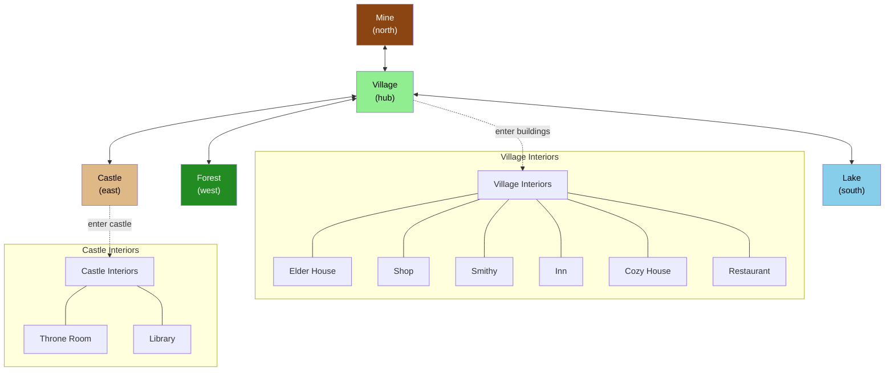
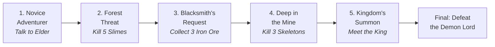
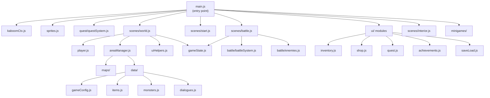
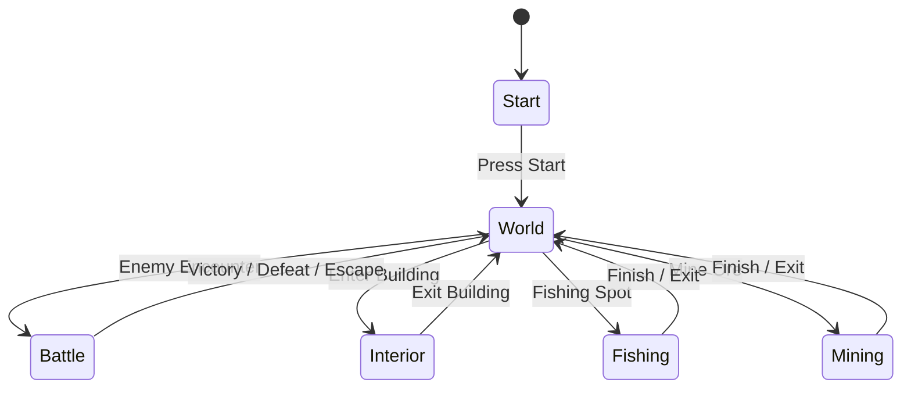
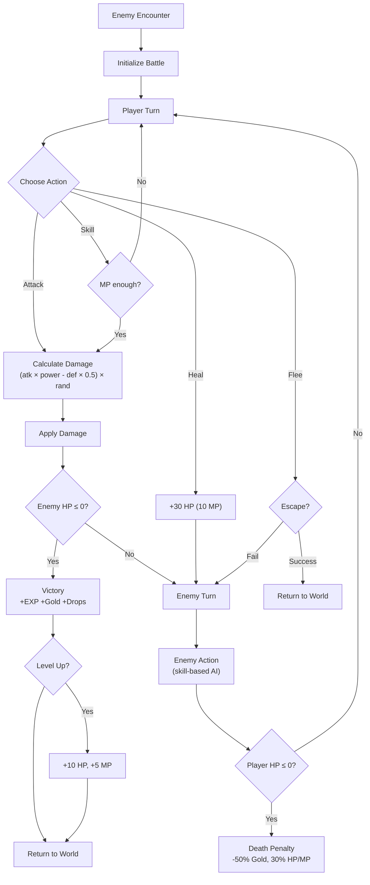

<div align="center"><a name="readme-top"></a>


# Kaboom RPG Adventure

### A 2D Pixel-Style RPG Adventure Game

An immersive pixel-art RPG adventure game built with Kaboom.js, featuring NPC dialogues, quest systems, turn-based combat, mini-games, and multiple explorable areas.<br/>
Experience classic RPG exploration with modern web technologies.

**Language:** [English](README.md) | [中文](README_zh.md)

<br/>

<!-- SHIELD GROUP -->

[![][github-stars-shield]][github-stars-link]
[![][github-forks-shield]][github-forks-link]
[![][github-issues-shield]][github-issues-link]
[![][github-license-shield]][github-license-link]

**Tech Stack:**


</div>

## Table of Contents

- [Introduction](#-introduction)
- [Key Features](#-key-features)
- [Demo](#-demo)
- [Tech Stack](#️-tech-stack)
- [Getting Started](#-getting-started)
- [Game Controls](#-game-controls)
- [Game World](#️-game-world)
- [Architecture](#-architecture)
- [Project Structure](#-project-structure)
- [Customization](#-customization)
- [Contributing](#-contributing)
- [License](#-license)
- [Author](#-author)

## Introduction

<table>
<tr>
<td>

**Kaboom RPG Adventure** is a classic 2D pixel-style RPG game that brings back the nostalgic feel of retro adventure games while leveraging modern web technologies. Built with the powerful Kaboom.js game engine and bundled with Vite for optimal performance.

**Why This Project?**

This project demonstrates how to build a complete RPG game using web technologies, featuring:
- A fully functional quest and dialogue system
- Turn-based combat mechanics with skill system
- Mini-games for resource gathering (fishing, mining)
- Multiple interconnected map areas with interior scenes
- Save/Load functionality with 3 save slots
- Automated CI/CD with GitHub Actions

**Goals:**
- Provide an engaging RPG experience in the browser
- Showcase modern JavaScript game development practices
- Create a modular and extensible game architecture

</td>
</tr>
</table>

> [!NOTE]
> - Node.js >= 18.0 required
> - Modern browser with ES6+ support
> - Keyboard or touch input device

## Key Features

### `1` Expansive Game World

Explore multiple interconnected areas including villages, castles, forests, lakes, and mines. Each area features unique NPCs, quests, and secrets to discover.

**Available Areas:**
- **Village** - Your starting point with shops, inn, blacksmith and friendly NPCs
- **Castle** - Meet royalty, receive important quests, encounter guards
- **Forest** - Battle slimes, goblins and wolves; gather mushrooms and herbs
- **Lake** - Peaceful fishing spot with hidden treasures
- **Mine** - Mine valuable ores and face bats, skeletons and golems

### `2` Turn-Based Combat System

Engage in strategic turn-based battles against various enemies. Level up your character, manage your health and resources, and defeat powerful bosses.

**Combat Features:**
- Strategic turn-based mechanics with 4 player skills (Attack, Power Strike, Heal, Fireball)
- 7 enemy types + 1 boss (Demon Lord), each with unique skills and AI
- Experience and leveling system (1.5x EXP scaling per level)
- Equipment system (weapon, shield, accessory slots)
- Damage formula with defense calculation and random variance

### `3` Mini-Games

Take a break from adventuring with engaging mini-games:
- **Fishing** - Timing-based catch mechanic at the lake for gold, EXP and quest progress
- **Mining** - Click-based ore extraction in the mines with combo system for bonus rewards

### `*` Additional Features

- [x] **NPC Dialogue System** - Rich conversations with 16+ unique NPCs
- [x] **Quest System** - 6 main quests + 4 side quests with auto-progression
- [x] **Inventory System** - 20-slot inventory with 65+ item types
- [x] **Shop System** - 3 shop types: general store, smithy, inn
- [x] **Save/Load System** - 3 save slots with localStorage persistence
- [x] **Achievement System** - Combat, collection, wealth, and level milestones
- [x] **Economy System** - Earn and spend gold, death penalty (50% gold loss)
- [x] **Interior Scenes** - 8 enterable buildings with Mi-Casa style tilesets
- [x] **Responsive Controls** - Keyboard (WASD/arrows), mouse click-to-move, and touch support

<div align="right">

[![][back-to-top]](#readme-top)

</div>

## Demo

Experience the game directly in your browser! Clone the repository and run `npm run dev` to start playing.

**Game Preview:**

| Start Screen | Village Exploration |
|:---:|:---:|
| Start your adventure | Interact with NPCs |

| Combat System | Mini-Games |
|:---:|:---:|
| Strategic battles | Fishing & Mining |

## Tech Stack

<div align="center">
  <table>
    <tr>
      <td align="center" width="96">
        
        <br>JavaScript
      </td>
      <td align="center" width="96">
        
        <br>Vite 5
      </td>
      <td align="center" width="96">
        
        <br>Vitest
      </td>
      <td align="center" width="96">
        
        <br>ESLint
      </td>
      <td align="center" width="96">
        
        <br>Prettier
      </td>
      <td align="center" width="96">
        
        <br>CI/CD
      </td>
    </tr>
  </table>
</div>

**Core Technologies:**
- **Game Engine**: Kaboom.js v3000 - A fun and fast 2D game library
- **Build Tool**: Vite v5 - Next generation frontend tooling
- **Language**: JavaScript (ES Modules)
- **Graphics**: Canvas API with pixel art sprites (16x16 tile-based)
- **Testing**: Vitest - Fast unit testing framework
- **Linting**: ESLint + Prettier - Code quality and formatting enforcement
- **CI/CD**: GitHub Actions - Automated lint, test, build & deploy to GitHub Pages

## Getting Started

### Prerequisites

> [!IMPORTANT]
> Ensure you have the following installed:

- Node.js 18.0+ ([Download](https://nodejs.org/))
- npm or yarn package manager
- Git ([Download](https://git-scm.com/))

### Installation

**1. Clone the Repository**

```bash
git clone https://github.com/ChanMeng666/kaboom-rpg-adventure.git
cd kaboom-rpg-adventure
```

**2. Install Dependencies**

```bash
npm install
```

### Available Scripts

| Command | Description |
|---------|-------------|
| `npm run dev` | Start development server at `http://localhost:5173` |
| `npm run build` | Build for production (output in `dist/`) |
| `npm run preview` | Preview production build |
| `npm run lint` | Run ESLint checks on `src/` |
| `npm run lint:fix` | Auto-fix ESLint issues |
| `npm run format` | Format code with Prettier |
| `npm run format:check` | Check formatting without changes |
| `npm run test` | Run unit tests once |
| `npm run test:watch` | Run tests in watch mode |

## Game Controls

| Action | Key / Gesture |
|--------|---------------|
| Movement | Arrow Keys / WASD |
| Interact | Collide with NPC or object |
| Confirm Dialogue | Enter / Space / Click |
| Move to Target | Mouse Click / Touch |
| Open Inventory | I |
| Open Quest Log | Q |
| Pause Menu | ESC |
| Debug Mode | F1 |

> [!TIP]
> The game supports both keyboard and touch controls, making it playable on both desktop and mobile devices.

## Game World

The game features 5 interconnected outdoor areas with the Village as a central hub, plus 8 enterable interior scenes:


```mermaid
graph TD
    M["Mine<br/>(north)"] <--> V["Village<br/>(hub)"]
    V <--> F["Forest<br/>(west)"]
    V <--> C["Castle<br/>(east)"]
    V <--> L["Lake<br/>(south)"]

    V -.->|enter buildings| VI["Village Interiors"]
    C -.->|enter castle| CI["Castle Interiors"]

    subgraph VI_SUB ["Village Interiors"]
        VI --- EH["Elder House"]
        VI --- SH["Shop"]
        VI --- SM["Smithy"]
        VI --- INN["Inn"]
        VI --- CZ["Cozy House"]
        VI --- RE["Restaurant"]
    end

    subgraph CI_SUB ["Castle Interiors"]
        CI --- TR["Throne Room"]
        CI --- LB["Library"]
    end

    style V fill:#90EE90,color:#000
    style F fill:#228B22,color:#fff
    style C fill:#DEB887,color:#000
    style L fill:#87CEEB,color:#000
    style M fill:#8B4513,color:#fff
```

**Area Details:**

| Area | NPCs | Quests | Mini-Games | Enemies | Key Features |
|------|------|--------|------------|---------|--------------|
| Village | Elder, Merchant, Blacksmith, Innkeeper, Villagers, Child, Archer | Main + Side | - | - | Hub area, shops, 6 enterable buildings |
| Forest | Archer | Main + Side | - | Slime, Goblin, Wolf | Mushrooms, herbs, chests |
| Lake | Fisher | Side | Fishing | - | Fishing spots, crystals, eggs |
| Mine | Miner | Main | Mining | Bat, Skeleton, Golem | Ores (copper/iron/gold/gems), crystals |
| Castle | King, Knights, Guards, Wizard | Main | - | Skeleton, Golem | Throne room, library, boss area |

### Main Quest Progression


```mermaid
flowchart LR
    Q1["1. Novice<br/>Adventurer<br/><i>Talk to Elder</i>"]
    Q2["2. Forest<br/>Threat<br/><i>Kill 5 Slimes</i>"]
    Q3["3. Blacksmith's<br/>Request<br/><i>Collect 3 Iron Ore</i>"]
    Q4["4. Deep in<br/>the Mine<br/><i>Kill 3 Skeletons</i>"]
    Q5["5. Kingdom's<br/>Summon<br/><i>Meet the King</i>"]
    QF["Final: Defeat<br/>the Demon Lord"]

    Q1 --> Q2 --> Q3 --> Q4 --> Q5 --> QF
```

**Side Quests:** Mushroom Collection, Fishing Master, Gem Collector, Easter Egg Hunter

## Architecture

### Module Architecture


```mermaid
graph TD
    MAIN["main.js<br/>(entry point)"] --> KABOOM["kaboomCtx.js"]
    MAIN --> SPRITES["sprites.js"]
    MAIN --> QUEST_SYS["quest/questSystem.js"]
    MAIN --> UI_MODS["ui/ modules"]

    MAIN --> S_START["scenes/start.js"]
    MAIN --> S_WORLD["scenes/world.js"]
    MAIN --> S_BATTLE["scenes/battle.js"]
    MAIN --> S_INTERIOR["scenes/interior.js"]
    MAIN --> S_MINI["minigames/"]

    S_WORLD --> PLAYER["player.js"]
    S_WORLD --> AREA_MGR["areaManager.js"]
    S_WORLD --> UI_HELP["uiHelpers.js"]
    S_WORLD --> STATE["gameState.js"]

    AREA_MGR --> MAPS["maps/"]
    AREA_MGR --> DATA["data/"]

    S_BATTLE --> BATTLE["battle/battleSystem.js"]
    S_BATTLE --> ENEMIES["battle/enemies.js"]
    S_BATTLE --> STATE

    DATA --> GC["gameConfig.js"]
    DATA --> ITEMS["items.js"]
    DATA --> MONS["monsters.js"]
    DATA --> DIAL["dialogues.js"]

    UI_MODS --> INV["inventory.js"]
    UI_MODS --> SHOP["shop.js"]
    UI_MODS --> QUEST_UI["quest.js"]
    UI_MODS --> ACH["achievements.js"]
    UI_MODS --> SAVE["saveLoad.js"]
```

### Scene Flow


```mermaid
stateDiagram-v2
    [*] --> Start
    Start --> World: Press Start
    World --> Battle: Enemy Encounter
    World --> Interior: Enter Building
    World --> Fishing: Fishing Spot
    World --> Mining: Mine Ore
    Battle --> World: Victory / Defeat / Escape
    Interior --> World: Exit Building
    Fishing --> World: Finish / Exit
    Mining --> World: Finish / Exit
```

### Battle System


```mermaid
flowchart TD
    START["Enemy Encounter"] --> INIT["Initialize Battle"]
    INIT --> PT["Player Turn"]
    PT --> CHOOSE{"Choose Action"}
    CHOOSE -->|"Attack"| CALC["Calculate Damage<br/>(atk × power - def × 0.5) × rand"]
    CHOOSE -->|"Skill"| MP{"MP enough?"}
    CHOOSE -->|"Heal"| HEAL["+30 HP (10 MP)"]
    CHOOSE -->|"Flee"| FLEE{"Escape?"}

    MP -->|Yes| CALC
    MP -->|No| PT
    CALC --> APPLY["Apply Damage"]
    APPLY --> DEAD{"Enemy HP ≤ 0?"}
    DEAD -->|Yes| WIN["Victory<br/>+EXP +Gold +Drops"]
    DEAD -->|No| ET["Enemy Turn"]

    HEAL --> ET
    FLEE -->|Success| ESC["Return to World"]
    FLEE -->|Fail| ET

    ET --> E_ATK["Enemy Action<br/>(skill-based AI)"]
    E_ATK --> P_DEAD{"Player HP ≤ 0?"}
    P_DEAD -->|Yes| LOSE["Death Penalty<br/>-50% Gold, 30% HP/MP"]
    P_DEAD -->|No| PT

    WIN --> LVL{"Level Up?"}
    LVL -->|Yes| UP["+10 HP, +5 MP"]
    LVL --> RET["Return to World"]
    UP --> RET
```

## Project Structure

```
kaboom-rpg-adventure/
├── src/
│   ├── main.js                # Entry point: init sprites, scenes, UI, quests
│   ├── kaboomCtx.js           # Kaboom.js instance configuration
│   ├── sprites.js             # Sprite & tileset loading (1200+ frames)
│   ├── gameState.js           # Centralized state management & persistence
│   ├── player.js              # Player entity, controls & animation
│   ├── areaManager.js         # Area loading, NPC/object spawning, portals
│   ├── uiHelpers.js           # Dialogue display, camera, HUD updates
│   ├── constants.js           # Backward-compatible re-exports from data/
│   ├── data/                  # Game data modules
│   │   ├── index.js           # Central data exports
│   │   ├── gameConfig.js      # Game configuration constants
│   │   ├── items.js           # Item definitions (shop items)
│   │   ├── monsters.js        # Monster stat definitions
│   │   └── dialogues.js       # NPC dialogue data (16+ NPCs)
│   ├── scenes/                # Scene modules
│   │   ├── start.js           # Start menu with particle effects
│   │   ├── world.js           # Main overworld gameplay
│   │   ├── battle.js          # Turn-based combat UI & logic
│   │   └── interior.js        # Interior scene rendering
│   ├── maps/                  # Map definitions (30×25 tiles each)
│   │   ├── index.js           # Map exports & portal definitions
│   │   ├── tileTypes.js       # Tile type constants (7 types)
│   │   ├── village.js         # Village map & objects
│   │   ├── forest.js          # Forest map & objects
│   │   ├── lake.js            # Lake map & objects
│   │   ├── mine.js            # Mine map & objects
│   │   ├── castle.js          # Castle map & objects
│   │   └── interiors.js       # 8 interior room definitions
│   ├── battle/                # Battle system
│   │   ├── battleSystem.js    # Core combat mechanics & skills
│   │   └── enemies.js         # Enemy data, AI, scaling & encounters
│   ├── quest/                 # Quest system
│   │   └── questSystem.js     # Quest definitions, tracking & rewards
│   ├── minigames/             # Mini-games
│   │   ├── fishing.js         # Timing-based fishing game
│   │   └── mining.js          # Click-based mining game with combos
│   └── ui/                    # UI components
│       ├── inventory.js       # Inventory panel (I key, 65+ items)
│       ├── shop.js            # Shop interface (3 shop types)
│       ├── quest.js           # Quest log panel (Q key)
│       ├── achievements.js    # Achievement tracking panel
│       └── saveLoad.js        # Save/load menu (3 slots)
├── src/__tests__/             # Unit tests
│   ├── gameState.test.js      # 40+ state management tests
│   └── data.test.js           # Data structure validation tests
├── public/                    # Static assets
│   ├── logo.svg               # Game logo
│   ├── spritesheet.png        # Main sprite sheet (624×496px, 39×31 tiles)
│   ├── assets/                # Minigame & UI image assets
│   └── tilesets/
│       └── interior/          # Mi-Casa interior tileset assets (7 files)
├── .github/
│   └── workflows/
│       └── deploy.yml         # CI/CD: lint → test → build → deploy
├── docs/
│   └── GAME_ASSETS.md         # Detailed sprite & asset documentation
├── index.html                 # HTML entry with game UI overlay
├── package.json               # Dependencies & scripts
├── vite.config.js             # Vite configuration
├── eslint.config.js           # ESLint rules
├── .prettierrc                # Prettier formatting rules
├── .editorconfig              # Editor consistency settings
├── jsconfig.json              # JS project & path alias config
├── CONTRIBUTING.md            # Contribution guidelines
├── CHANGELOG.md               # Version history
└── LICENSE                    # MIT License
```

## Customization

### Modify Maps

Edit map files in `src/maps/` directory to customize the game world layout. Each map is a 30x25 tile grid with objects defined as arrays of NPCs, chests, trees, etc.

### Add NPCs

1. Define NPC dialogue in `src/data/dialogues.js`
2. Add NPC spawning in the respective map file's objects array (`src/maps/`)
3. For shop NPCs, add item data in `src/data/items.js`

### Add Enemies

1. Add monster stats in `src/data/monsters.js`
2. Add enemy sprite frames and skills in `src/battle/enemies.js`
3. Register encounter areas in the `getRandomEncounter()` function

### Add Quests

Update `src/quest/questSystem.js` to add new quests with objectives, rewards, and NPC givers.

### Change Sprites

Modify frame indices in `src/sprites.js`. The main spritesheet is `public/spritesheet.png` (39x31 tiles, 16x16px each). See `docs/GAME_ASSETS.md` for a complete sprite index.

**Recommended Free Resources:**
- [Kenney.nl](https://kenney.nl/) - CC0 free game assets
- [OpenGameArt](https://opengameart.org/) - Community free resources
- [itch.io](https://itch.io/game-assets/free) - Free game assets

## Contributing

Contributions are welcome! Please read **[CONTRIBUTING.md](CONTRIBUTING.md)** for detailed development setup and coding conventions.

**Quick Start:**

1. **Fork** the repository
2. **Create** a feature branch (`git checkout -b feature/amazing-feature`)
3. **Run checks**: `npm run lint` and `npm test`
4. **Commit** your changes (`git commit -m 'Add amazing feature'`)
5. **Push** to the branch (`git push origin feature/amazing-feature`)
6. **Open** a Pull Request

**Contribution Ideas:**
- New features (weapons, spells, areas, quests)
- New sprites and assets
- Bug fixes
- Documentation improvements
- Translations

> [!NOTE]
> The project uses GitHub Actions CI/CD. Every push to `master` triggers: lint → test → build → deploy to GitHub Pages. Make sure `npm run lint` and `npm test` pass locally before pushing.

[![][pr-welcome-shield]][pr-welcome-link]

## License

This project is licensed under the **MIT License** - see the [LICENSE](LICENSE) file for details.

## Author

**Chan Meng**

-  LinkedIn: [chanmeng666](https://www.linkedin.com/in/chanmeng666/)
-  GitHub: [ChanMeng666](https://github.com/ChanMeng666)

---

<div align="center">

**Start Your Adventure Today!**

If you enjoy the game, please **Star** this repo!

<br/>

Made with care by [Chan Meng](https://github.com/ChanMeng666)

</div>

<!-- LINK DEFINITIONS -->

[back-to-top]: https://img.shields.io/badge/-BACK_TO_TOP-151515?style=flat-square

<!-- GitHub Links -->
[github-stars-link]: https://github.com/ChanMeng666/kaboom-rpg-adventure/stargazers
[github-forks-link]: https://github.com/ChanMeng666/kaboom-rpg-adventure/forks
[github-issues-link]: https://github.com/ChanMeng666/kaboom-rpg-adventure/issues
[github-license-link]: https://github.com/ChanMeng666/kaboom-rpg-adventure/blob/main/LICENSE
[pr-welcome-link]: https://github.com/ChanMeng666/kaboom-rpg-adventure/pulls

<!-- Shield Badges -->
[github-stars-shield]: https://img.shields.io/github/stars/ChanMeng666/kaboom-rpg-adventure?color=ffcb47&labelColor=black&style=flat-square
[github-forks-shield]: https://img.shields.io/github/forks/ChanMeng666/kaboom-rpg-adventure?color=8ae8ff&labelColor=black&style=flat-square
[github-issues-shield]: https://img.shields.io/github/issues/ChanMeng666/kaboom-rpg-adventure?color=ff80eb&labelColor=black&style=flat-square
[github-license-shield]: https://img.shields.io/badge/license-MIT-white?labelColor=black&style=flat-square
[pr-welcome-shield]: https://img.shields.io/badge/PRs_welcome-%E2%86%92-ffcb47?labelColor=black&style=for-the-badge
