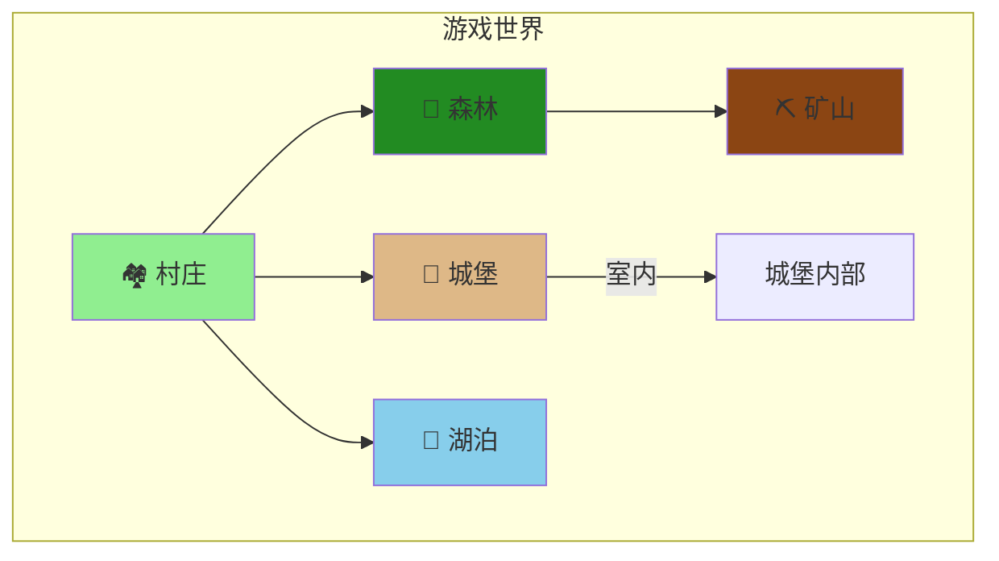

<div align="center"><a name="readme-top"></a>

# 🎮 Kaboom RPG 冒险游戏

### 2D 像素风格 RPG 冒险游戏

一款基于 Kaboom.js 构建的沉浸式像素风格 RPG 冒险游戏，拥有 NPC 对话系统、任务系统、回合制战斗、小游戏以及多个可探索区域。<br/>
使用现代 Web 技术体验经典 RPG 探索乐趣。

**🌐 语言 / Language:** [English](README.md) | [中文](README_zh.md)

<br/>

<!-- SHIELD GROUP -->

[![][github-stars-shield]][github-stars-link]
[![][github-forks-shield]][github-forks-link]
[![][github-issues-shield]][github-issues-link]
[![][github-license-shield]][github-license-link]

**技术栈：**


</div>

## 📑 目录

- [🎮 Kaboom RPG 冒险游戏](#-kaboom-rpg-冒险游戏)
  - [📑 目录](#-目录)
  - [🌟 简介](#-简介)
  - [✨ 核心特性](#-核心特性)
  - [🎬 演示](#-演示)
  - [🛠️ 技术栈](#️-技术栈)
  - [🚀 快速开始](#-快速开始)
    - [环境要求](#环境要求)
    - [安装步骤](#安装步骤)
    - [开发模式](#开发模式)
    - [生产构建](#生产构建)
  - [🎮 游戏控制](#-游戏控制)
  - [🗺️ 游戏世界](#️-游戏世界)
  - [📁 项目结构](#-项目结构)
  - [🎨 自定义扩展](#-自定义扩展)
  - [🤝 参与贡献](#-参与贡献)
  - [📄 开源许可](#-开源许可)
  - [👤 作者](#-作者)

## 🌟 简介

<table>
<tr>
<td>

**Kaboom RPG 冒险游戏** 是一款经典的 2D 像素风格 RPG 游戏，在利用现代 Web 技术的同时，带来怀旧复古冒险游戏的感觉。使用强大的 Kaboom.js 游戏引擎构建，并通过 Vite 打包以获得最佳性能。

**为什么做这个项目？**

这个项目展示了如何使用 Web 技术构建一个完整的 RPG 游戏，包含：
- 完整的任务和对话系统
- 回合制战斗机制
- 资源收集小游戏
- 多个相互连接的地图区域
- 存档/读档功能

**项目目标：**
- 在浏览器中提供引人入胜的 RPG 体验
- 展示现代 JavaScript 游戏开发实践
- 创建模块化且可扩展的游戏架构

</td>
</tr>
</table>

> [!NOTE]
> - 需要 Node.js >= 18.0
> - 支持 ES6+ 的现代浏览器
> - 键盘或触摸输入设备

## ✨ 核心特性

### `1` 🗺️ 广阔的游戏世界

探索多个相互连接的区域，包括村庄、城堡、森林、湖泊和矿山。每个区域都有独特的 NPC、任务和待发现的秘密。

**可用区域：**
- 🏘️ **村庄** - 你的起点，有商店和友好的 NPC
- 🏰 **城堡** - 与皇室会面并接受重要任务
- 🌲 **森林** - 与怪物战斗并收集资源
- 🌊 **湖泊** - 宁静的钓鱼点，隐藏着宝藏
- ⛏️ **矿山** - 开采珍贵矿石并面对地下危险

### `2` ⚔️ 回合制战斗系统

与各种敌人进行策略性回合制战斗。升级你的角色，管理你的生命值和资源，击败强大的 Boss。

**战斗特性：**
- 策略性回合制机制
- 多种敌人类型，各有独特行为
- 经验值和等级系统
- 生命值和资源管理

### `3` 🎣 小游戏

在冒险之余享受有趣的小游戏：
- **钓鱼** - 在湖边钓鱼获得金币和物品
- **采矿** - 在矿山挖掘珍贵的矿石和宝石

### `*` 更多特性

- [x] 💬 **NPC 对话系统** - 丰富的分支对话
- [x] 📜 **任务系统** - 追踪和完成各种任务
- [x] 🎒 **背包系统** - 管理你的物品和装备
- [x] 🏪 **商店系统** - 与商人买卖物品
- [x] 💾 **存档系统** - 随时继续你的冒险
- [x] 🏆 **成就系统** - 解锁成就记录你的成就
- [x] 💰 **经济系统** - 在游戏中赚取和花费金币
- [x] 📱 **响应式控制** - 支持键盘和触摸输入

<div align="right">

[![][back-to-top]](#readme-top)

</div>

## 🎬 演示

直接在浏览器中体验游戏！克隆仓库并运行 `npm run dev` 开始游戏。

**游戏预览：**

| 开始界面 | 村庄探索 |
|:---:|:---:|
| 开始你的冒险 | 与 NPC 互动 |

| 战斗系统 | 小游戏 |
|:---:|:---:|
| 策略战斗 | 钓鱼和采矿 |

## 🛠️ 技术栈

<div align="center">
  <table>
    <tr>
      <td align="center" width="96">
        
        <br>JavaScript
      </td>
      <td align="center" width="96">
        
        <br>Vite 5
      </td>
      <td align="center" width="96">
        
        <br>HTML5
      </td>
      <td align="center" width="96">
        
        <br>CSS3
      </td>
    </tr>
  </table>
</div>

**核心技术：**
- **游戏引擎**：Kaboom.js v3000 - 一个有趣且快速的 2D 游戏库
- **构建工具**：Vite v5 - 下一代前端构建工具
- **编程语言**：JavaScript (ES Modules)
- **图形渲染**：Canvas API 配合像素艺术精灵

**在线资源：**
- **Kaboom 官方精灵**：`https://cdn.jsdelivr.net/gh/replit/kaboom@master/sprites/`
- **动态瓦片**：使用 Canvas API 生成

## 🚀 快速开始

### 环境要求

> [!IMPORTANT]
> 确保已安装以下软件：

- Node.js 18.0+ ([下载](https://nodejs.org/))
- npm 或 yarn 包管理器
- Git ([下载](https://git-scm.com/))

### 安装步骤

**1. 克隆仓库**

```bash
git clone https://github.com/ChanMeng666/kaboom-rpg-adventure.git
cd kaboom-rpg-adventure
```

**2. 安装依赖**

```bash
npm install
```

### 开发模式

```bash
npm run dev
```

打开浏览器访问 `http://localhost:5173`

### 生产构建

```bash
npm run build
```

构建产物将输出到 `dist/` 目录。

**预览构建：**

```bash
npm run preview
```

## 🎮 游戏控制

| 操作 | 按键/手势 |
|--------|-------------|
| 移动 | 方向键 / WASD |
| 交互 | 碰撞 NPC 或物体 |
| 确认对话 | Enter / 空格 / 点击 |
| 移动到目标点 | 鼠标点击 / 触摸 |
| 调试模式 | F1 |

> [!TIP]
> 游戏支持键盘和触摸控制，可在桌面和移动设备上游玩。

## 🗺️ 游戏世界

游戏包含多个相互连接的区域，每个区域都有独特的内容：



**区域特性：**

| 区域 | NPC | 任务 | 小游戏 | 敌人 |
|------|------|--------|------------|---------|
| 村庄 | ✅ | ✅ | ❌ | ❌ |
| 城堡 | ✅ | ✅ | ❌ | ❌ |
| 森林 | ✅ | ✅ | ❌ | ✅ |
| 湖泊 | ✅ | ✅ | 🎣 钓鱼 | ❌ |
| 矿山 | ✅ | ✅ | ⛏️ 采矿 | ✅ |

## 📁 项目结构

```
kaboom-rpg-adventure/
├── src/
│   ├── main.js              # 主入口
│   ├── kaboomCtx.js         # Kaboom 初始化
│   ├── constants.js         # 游戏常量和数据
│   ├── utils.js             # 工具函数
│   ├── sprites.js           # 精灵资源加载
│   ├── player.js            # 玩家角色模块
│   ├── world.js             # 游戏世界模块
│   ├── gameState.js         # 全局游戏状态
│   ├── areaManager.js       # 区域切换管理
│   ├── scenes/              # 场景模块
│   │   ├── start.js         # 开始菜单场景
│   │   ├── world.js         # 主世界场景
│   │   ├── battle.js        # 战斗场景
│   │   └── interior.js      # 室内场景
│   ├── maps/                # 地图定义
│   │   ├── index.js         # 地图导出
│   │   ├── tileTypes.js     # 瓦片类型定义
│   │   ├── village.js       # 村庄地图
│   │   ├── castle.js        # 城堡地图
│   │   ├── forest.js        # 森林地图
│   │   ├── lake.js          # 湖泊地图
│   │   ├── mine.js          # 矿山地图
│   │   └── interiors.js     # 室内地图
│   ├── battle/              # 战斗系统
│   │   ├── battleSystem.js  # 核心战斗机制
│   │   └── enemies.js       # 敌人定义
│   ├── quest/               # 任务系统
│   │   └── questSystem.js   # 任务管理
│   ├── minigames/           # 小游戏
│   │   ├── fishing.js       # 钓鱼小游戏
│   │   └── mining.js        # 采矿小游戏
│   └── ui/                  # UI 组件
│       ├── inventory.js     # 背包界面
│       ├── shop.js          # 商店界面
│       ├── quest.js         # 任务界面
│       ├── achievements.js  # 成就界面
│       └── saveLoad.js      # 存档界面
├── public/                  # 静态资源
│   └── spritesheet.png      # 游戏精灵
├── index.html               # HTML 入口
├── package.json             # 依赖配置
└── vite.config.js           # Vite 配置
```

## 🎨 自定义扩展

### 修改地图

编辑 `src/maps/` 目录中的地图文件来自定义游戏世界布局。

### 添加 NPC

1. 在 `src/constants.js` 中定义 NPC 数据
2. 在相应的地图文件中添加 NPC 生成逻辑
3. 在 `DIALOGUE_DATA` 中创建对话内容

### 添加任务

更新 `src/quest/questSystem.js` 以添加新任务、目标和奖励。

### 更换精灵

修改 `src/sprites.js` 中的 URL 来使用不同的在线精灵资源。

**推荐免费资源：**
- [Kenney.nl](https://kenney.nl/) - CC0 免费游戏素材
- [OpenGameArt](https://opengameart.org/) - 社区免费资源
- [itch.io](https://itch.io/game-assets/free) - 免费游戏素材

## 🤝 参与贡献

欢迎贡献！以下是你可以帮助的方式：

1. **Fork** 本仓库
2. **创建** 功能分支 (`git checkout -b feature/amazing-feature`)
3. **提交** 你的更改 (`git commit -m 'Add amazing feature'`)
4. **推送** 到分支 (`git push origin feature/amazing-feature`)
5. **打开** Pull Request

**贡献建议：**
- 🐛 Bug 修复
- ✨ 新功能（武器、法术、区域）
- 🎨 新的精灵和素材
- 📚 文档改进
- 🌐 翻译

[![][pr-welcome-shield]][pr-welcome-link]

## 📄 开源许可

本项目采用 **MIT 许可证** - 详情请查看 [LICENSE](LICENSE) 文件。

**开源优势：**
- ✅ 允许商业使用
- ✅ 允许修改
- ✅ 允许分发
- ✅ 允许私人使用

## 👤 作者

**Chan Meng**

-  LinkedIn: [chanmeng666](https://www.linkedin.com/in/chanmeng666/)
-  GitHub: [ChanMeng666](https://github.com/ChanMeng666)

---

<div align="center">

**🎮 今天就开始你的冒险吧！🌟**

⭐ 如果你喜欢这个游戏，请给这个仓库点个 **Star**！

<br/>

由 [Chan Meng](https://github.com/ChanMeng666) 用 ❤️ 制作

</div>

<!-- LINK DEFINITIONS -->

[back-to-top]: https://img.shields.io/badge/-返回顶部-151515?style=flat-square

<!-- GitHub Links -->
[github-stars-link]: https://github.com/ChanMeng666/kaboom-rpg-adventure/stargazers
[github-forks-link]: https://github.com/ChanMeng666/kaboom-rpg-adventure/forks
[github-issues-link]: https://github.com/ChanMeng666/kaboom-rpg-adventure/issues
[github-license-link]: https://github.com/ChanMeng666/kaboom-rpg-adventure/blob/main/LICENSE
[pr-welcome-link]: https://github.com/ChanMeng666/kaboom-rpg-adventure/pulls

<!-- Shield Badges -->
[github-stars-shield]: https://img.shields.io/github/stars/ChanMeng666/kaboom-rpg-adventure?color=ffcb47&labelColor=black&style=flat-square
[github-forks-shield]: https://img.shields.io/github/forks/ChanMeng666/kaboom-rpg-adventure?color=8ae8ff&labelColor=black&style=flat-square
[github-issues-shield]: https://img.shields.io/github/issues/ChanMeng666/kaboom-rpg-adventure?color=ff80eb&labelColor=black&style=flat-square
[github-license-shield]: https://img.shields.io/badge/license-MIT-white?labelColor=black&style=flat-square
[pr-welcome-shield]: https://img.shields.io/badge/🤝_欢迎PR-%E2%86%92-ffcb47?labelColor=black&style=for-the-badge
