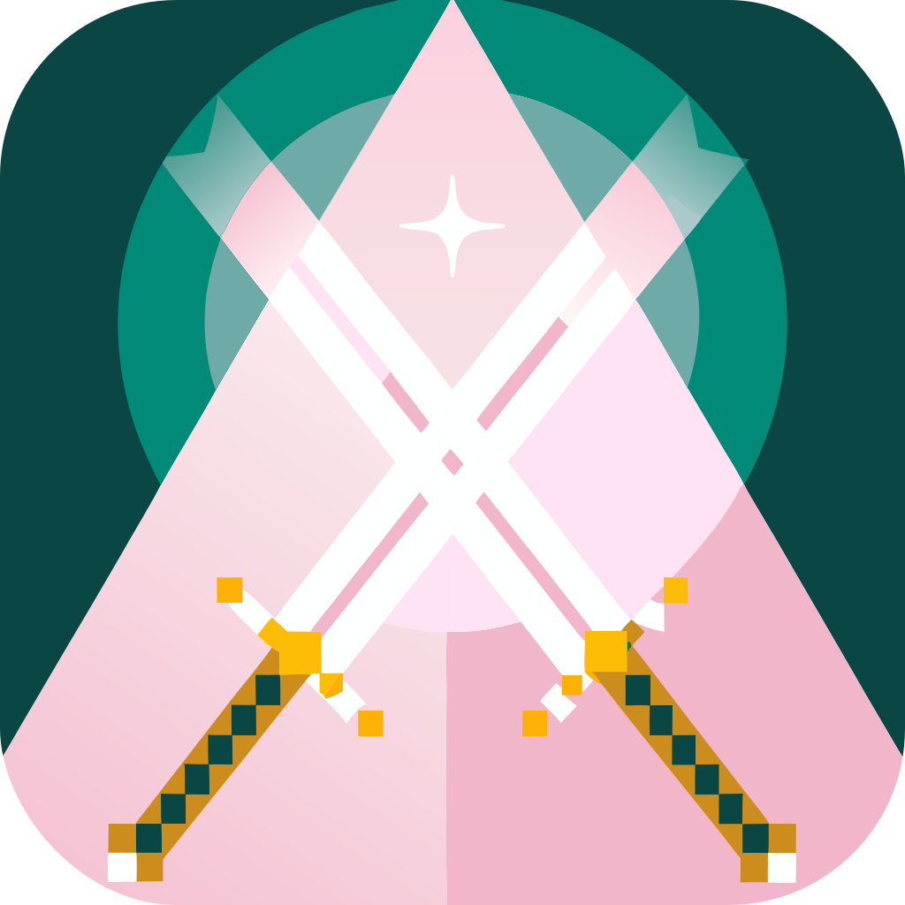
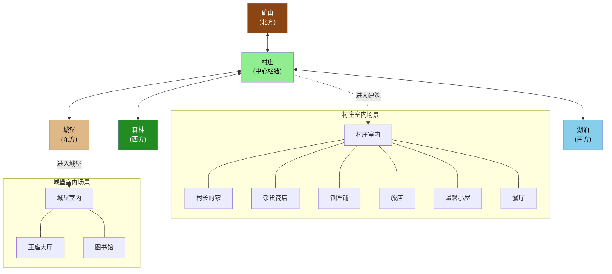
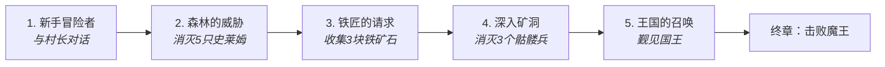
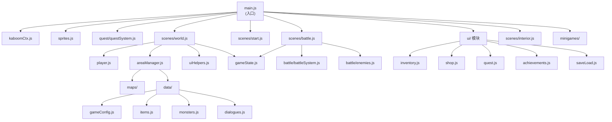
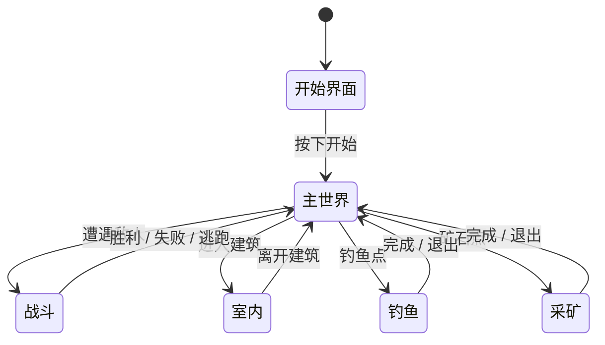
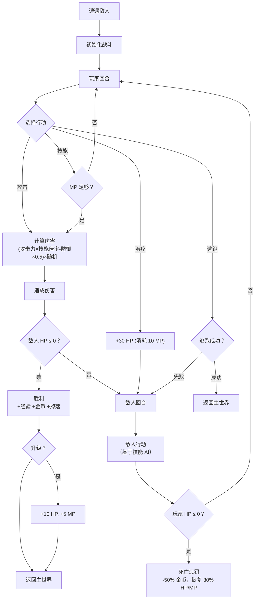

<div align="center"><a name="readme-top"></a>



# Kaboom RPG 冒险游戏

### 2D 像素风格 RPG 冒险游戏

一款基于 Kaboom.js 构建的沉浸式像素风格 RPG 冒险游戏，拥有 NPC 对话系统、任务系统、回合制战斗、小游戏以及多个可探索区域。<br/>
使用现代 Web 技术体验经典 RPG 探索乐趣。

**语言 / Language:** [English](README.md) | [中文](README_zh.md)

<br/>

<!-- SHIELD GROUP -->

[![][github-stars-shield]][github-stars-link]
[![][github-forks-shield]][github-forks-link]
[![][github-issues-shield]][github-issues-link]
[![][github-license-shield]][github-license-link]

**技术栈：**


</div>

## 目录

- [简介](#-简介)
- [核心特性](#-核心特性)
- [演示](#-演示)
- [技术栈](#️-技术栈)
- [快速开始](#-快速开始)
- [游戏控制](#-游戏控制)
- [游戏世界](#️-游戏世界)
- [架构设计](#-架构设计)
- [项目结构](#-项目结构)
- [自定义扩展](#-自定义扩展)
- [参与贡献](#-参与贡献)
- [开源许可](#-开源许可)
- [作者](#-作者)

## 简介

<table>
<tr>
<td>

**Kaboom RPG 冒险游戏** 是一款经典的 2D 像素风格 RPG 游戏，在利用现代 Web 技术的同时，带来怀旧复古冒险游戏的感觉。使用强大的 Kaboom.js 游戏引擎构建，并通过 Vite 打包以获得最佳性能。

**为什么做这个项目？**

这个项目展示了如何使用 Web 技术构建一个完整的 RPG 游戏，包含：
- 完整的任务和对话系统
- 回合制战斗机制与技能系统
- 资源收集小游戏（钓鱼、采矿）
- 多个相互连接的地图区域与室内场景
- 3 个存档槽位的存读档功能
- GitHub Actions 自动化 CI/CD 流水线

**项目目标：**
- 在浏览器中提供引人入胜的 RPG 体验
- 展示现代 JavaScript 游戏开发实践
- 创建模块化且可扩展的游戏架构

</td>
</tr>
</table>

> [!NOTE]
> - 需要 Node.js >= 18.0
> - 支持 ES6+ 的现代浏览器
> - 键盘或触摸输入设备

## 核心特性

### `1` 广阔的游戏世界

探索多个相互连接的区域，包括村庄、城堡、森林、湖泊和矿山。每个区域都有独特的 NPC、任务和待发现的秘密。

**可用区域：**
- **村庄** - 你的起点，有商店、旅店、铁匠铺和友好的 NPC
- **城堡** - 与国王会面，接受重要任务，遭遇守卫
- **森林** - 与史莱姆、哥布林和野狼战斗；采集蘑菇和草药
- **湖泊** - 宁静的钓鱼点，隐藏着宝藏
- **矿山** - 开采珍贵矿石，面对蝙蝠、骷髅兵和岩石傀儡

### `2` 回合制战斗系统

与各种敌人进行策略性回合制战斗。升级你的角色，管理生命值和资源，击败强大的 Boss。

**战斗特性：**
- 策略性回合制机制，4 种玩家技能（攻击、重击、治疗、火球术）
- 7 种敌人类型 + 1 个 Boss（魔王），各有独特技能和 AI
- 经验值和等级系统（每级 1.5 倍经验需求）
- 装备系统（武器、盾牌、饰品槽位）
- 伤害公式包含防御计算和随机浮动

### `3` 小游戏

在冒险之余享受有趣的小游戏：
- **钓鱼** - 在湖边进行计时抓鱼，获取金币、经验和任务进度
- **采矿** - 在矿山点击采矿，连击系统可获得额外奖励

### `*` 更多特性

- [x] **NPC 对话系统** - 与 16+ 个独特 NPC 进行丰富对话
- [x] **任务系统** - 6 个主线任务 + 4 个支线任务，自动推进
- [x] **背包系统** - 20 格背包，65+ 种物品类型
- [x] **商店系统** - 3 种商店类型：杂货店、铁匠铺、旅店
- [x] **存档系统** - 3 个存档槽位，localStorage 持久化
- [x] **成就系统** - 战斗、收集、财富和等级里程碑
- [x] **经济系统** - 赚取和花费金币，死亡惩罚（损失 50% 金币）
- [x] **室内场景** - 8 个可进入的建筑，Mi-Casa 风格贴图
- [x] **响应式控制** - 键盘（WASD/方向键）、鼠标点击移动和触摸支持

<div align="right">

[![][back-to-top]](#readme-top)

</div>

## 演示

直接在浏览器中体验游戏！克隆仓库并运行 `npm run dev` 开始游戏。

**游戏预览：**

| 开始界面 | 村庄探索 |
|:---:|:---:|
| 开始你的冒险 | 与 NPC 互动 |

| 战斗系统 | 小游戏 |
|:---:|:---:|
| 策略战斗 | 钓鱼和采矿 |

## 技术栈

<div align="center">
  <table>
    <tr>
      <td align="center" width="96">
        
        <br>JavaScript
      </td>
      <td align="center" width="96">
        
        <br>Vite 5
      </td>
      <td align="center" width="96">
        
        <br>Vitest
      </td>
      <td align="center" width="96">
        
        <br>ESLint
      </td>
      <td align="center" width="96">
        
        <br>Prettier
      </td>
      <td align="center" width="96">
        
        <br>CI/CD
      </td>
    </tr>
  </table>
</div>

**核心技术：**
- **游戏引擎**：Kaboom.js v3000 - 有趣且快速的 2D 游戏库
- **构建工具**：Vite v5 - 下一代前端构建工具
- **编程语言**：JavaScript (ES Modules)
- **图形渲染**：Canvas API 配合像素艺术精灵（16x16 瓦片系统）
- **测试框架**：Vitest - 快速单元测试框架
- **代码质量**：ESLint + Prettier - 代码检查与格式化
- **CI/CD**：GitHub Actions - 自动化检查、测试、构建并部署到 GitHub Pages

## 快速开始

### 环境要求

> [!IMPORTANT]
> 确保已安装以下软件：

- Node.js 18.0+ ([下载](https://nodejs.org/))
- npm 或 yarn 包管理器
- Git ([下载](https://git-scm.com/))

### 安装步骤

**1. 克隆仓库**

```bash
git clone https://github.com/ChanMeng666/kaboom-rpg-adventure.git
cd kaboom-rpg-adventure
```

**2. 安装依赖**

```bash
npm install
```

### 可用脚本

| 命令 | 说明 |
|------|------|
| `npm run dev` | 启动开发服务器 `http://localhost:5173` |
| `npm run build` | 生产构建（输出到 `dist/`） |
| `npm run preview` | 预览生产构建 |
| `npm run lint` | 对 `src/` 运行 ESLint 检查 |
| `npm run lint:fix` | 自动修复 ESLint 问题 |
| `npm run format` | 使用 Prettier 格式化代码 |
| `npm run format:check` | 检查格式化（不修改文件） |
| `npm run test` | 运行单元测试 |
| `npm run test:watch` | 以监听模式运行测试 |

## 游戏控制

| 操作 | 按键 / 手势 |
|------|-------------|
| 移动 | 方向键 / WASD |
| 交互 | 碰撞 NPC 或物体 |
| 确认对话 | Enter / 空格 / 点击 |
| 移动到目标点 | 鼠标点击 / 触摸 |
| 打开背包 | I |
| 打开任务日志 | Q |
| 暂停菜单 | ESC |
| 调试模式 | F1 |

> [!TIP]
> 游戏支持键盘和触摸控制，可在桌面和移动设备上游玩。

## 游戏世界

游戏包含 5 个相互连接的户外区域（村庄为中心枢纽），以及 8 个可进入的室内场景：


```mermaid
graph TD
    M["矿山<br/>(北方)"] <--> V["村庄<br/>(中心枢纽)"]
    V <--> F["森林<br/>(西方)"]
    V <--> C["城堡<br/>(东方)"]
    V <--> L["湖泊<br/>(南方)"]

    V -.->|进入建筑| VI["村庄室内"]
    C -.->|进入城堡| CI["城堡室内"]

    subgraph VI_SUB ["村庄室内场景"]
        VI --- EH["村长的家"]
        VI --- SH["杂货商店"]
        VI --- SM["铁匠铺"]
        VI --- INN["旅店"]
        VI --- CZ["温馨小屋"]
        VI --- RE["餐厅"]
    end

    subgraph CI_SUB ["城堡室内场景"]
        CI --- TR["王座大厅"]
        CI --- LB["图书馆"]
    end

    style V fill:#90EE90,color:#000
    style F fill:#228B22,color:#fff
    style C fill:#DEB887,color:#000
    style L fill:#87CEEB,color:#000
    style M fill:#8B4513,color:#fff
```

**区域详情：**

| 区域 | NPC | 任务 | 小游戏 | 敌人 | 主要特色 |
|------|------|------|--------|------|----------|
| 村庄 | 村长、商人、铁匠、旅店老板、村民、小孩、弓箭手 | 主线 + 支线 | - | - | 中心枢纽，商店，6 个可进入建筑 |
| 森林 | 弓箭手 | 主线 + 支线 | - | 史莱姆、哥布林、野狼 | 蘑菇、草药、宝箱 |
| 湖泊 | 渔夫 | 支线 | 钓鱼 | - | 钓鱼点、水晶、彩蛋 |
| 矿山 | 矿工 | 主线 | 采矿 | 蝙蝠、骷髅兵、岩石傀儡 | 矿石（铜/铁/金/宝石）、水晶 |
| 城堡 | 国王、骑士、守卫、法师 | 主线 | - | 骷髅兵、岩石傀儡 | 王座大厅、图书馆、Boss 区域 |

### 主线任务进度


```mermaid
flowchart LR
    Q1["1. 新手冒险者<br/><i>与村长对话</i>"]
    Q2["2. 森林的威胁<br/><i>消灭5只史莱姆</i>"]
    Q3["3. 铁匠的请求<br/><i>收集3块铁矿石</i>"]
    Q4["4. 深入矿洞<br/><i>消灭3个骷髅兵</i>"]
    Q5["5. 王国的召唤<br/><i>觐见国王</i>"]
    QF["终章：击败魔王"]

    Q1 --> Q2 --> Q3 --> Q4 --> Q5 --> QF
```

**支线任务：** 蘑菇采集、钓鱼高手、宝石收藏家、彩蛋猎人

## 架构设计

### 模块架构


```mermaid
graph TD
    MAIN["main.js<br/>(入口)"] --> KABOOM["kaboomCtx.js"]
    MAIN --> SPRITES["sprites.js"]
    MAIN --> QUEST_SYS["quest/questSystem.js"]
    MAIN --> UI_MODS["ui/ 模块"]

    MAIN --> S_START["scenes/start.js"]
    MAIN --> S_WORLD["scenes/world.js"]
    MAIN --> S_BATTLE["scenes/battle.js"]
    MAIN --> S_INTERIOR["scenes/interior.js"]
    MAIN --> S_MINI["minigames/"]

    S_WORLD --> PLAYER["player.js"]
    S_WORLD --> AREA_MGR["areaManager.js"]
    S_WORLD --> UI_HELP["uiHelpers.js"]
    S_WORLD --> STATE["gameState.js"]

    AREA_MGR --> MAPS["maps/"]
    AREA_MGR --> DATA["data/"]

    S_BATTLE --> BATTLE["battle/battleSystem.js"]
    S_BATTLE --> ENEMIES["battle/enemies.js"]
    S_BATTLE --> STATE

    DATA --> GC["gameConfig.js"]
    DATA --> ITEMS["items.js"]
    DATA --> MONS["monsters.js"]
    DATA --> DIAL["dialogues.js"]

    UI_MODS --> INV["inventory.js"]
    UI_MODS --> SHOP["shop.js"]
    UI_MODS --> QUEST_UI["quest.js"]
    UI_MODS --> ACH["achievements.js"]
    UI_MODS --> SAVE["saveLoad.js"]
```

### 场景流转


```mermaid
stateDiagram-v2
    [*] --> 开始界面
    开始界面 --> 主世界: 按下开始
    主世界 --> 战斗: 遭遇敌人
    主世界 --> 室内: 进入建筑
    主世界 --> 钓鱼: 钓鱼点
    主世界 --> 采矿: 矿石点
    战斗 --> 主世界: 胜利 / 失败 / 逃跑
    室内 --> 主世界: 离开建筑
    钓鱼 --> 主世界: 完成 / 退出
    采矿 --> 主世界: 完成 / 退出
```

### 战斗系统


```mermaid
flowchart TD
    START["遭遇敌人"] --> INIT["初始化战斗"]
    INIT --> PT["玩家回合"]
    PT --> CHOOSE{"选择行动"}
    CHOOSE -->|"攻击"| CALC["计算伤害<br/>(攻击力×技能倍率-防御×0.5)×随机"]
    CHOOSE -->|"技能"| MP{"MP 足够？"}
    CHOOSE -->|"治疗"| HEAL["+30 HP (消耗 10 MP)"]
    CHOOSE -->|"逃跑"| FLEE{"逃跑成功？"}

    MP -->|是| CALC
    MP -->|否| PT
    CALC --> APPLY["造成伤害"]
    APPLY --> DEAD{"敌人 HP ≤ 0？"}
    DEAD -->|是| WIN["胜利<br/>+经验 +金币 +掉落"]
    DEAD -->|否| ET["敌人回合"]

    HEAL --> ET
    FLEE -->|成功| ESC["返回主世界"]
    FLEE -->|失败| ET

    ET --> E_ATK["敌人行动<br/>（基于技能 AI）"]
    E_ATK --> P_DEAD{"玩家 HP ≤ 0？"}
    P_DEAD -->|是| LOSE["死亡惩罚<br/>-50% 金币，恢复 30% HP/MP"]
    P_DEAD -->|否| PT

    WIN --> LVL{"升级？"}
    LVL -->|是| UP["+10 HP, +5 MP"]
    LVL --> RET["返回主世界"]
    UP --> RET
```

## 项目结构

```
kaboom-rpg-adventure/
├── src/
│   ├── main.js                # 入口：初始化精灵、场景、UI、任务
│   ├── kaboomCtx.js           # Kaboom.js 实例配置
│   ├── sprites.js             # 精灵和贴图加载（1200+ 帧）
│   ├── gameState.js           # 集中式状态管理与持久化
│   ├── player.js              # 玩家实体、控制与动画
│   ├── areaManager.js         # 区域加载、NPC/物体生成、传送门
│   ├── uiHelpers.js           # 对话显示、摄像机、HUD 更新
│   ├── constants.js           # 向后兼容的 data/ 重导出
│   ├── data/                  # 游戏数据模块
│   │   ├── index.js           # 统一数据导出
│   │   ├── gameConfig.js      # 游戏配置常量
│   │   ├── items.js           # 物品定义（商店物品）
│   │   ├── monsters.js        # 怪物属性定义
│   │   └── dialogues.js       # NPC 对话数据（16+ NPC）
│   ├── scenes/                # 场景模块
│   │   ├── start.js           # 开始菜单（粒子特效）
│   │   ├── world.js           # 主世界游戏场景
│   │   ├── battle.js          # 回合制战斗 UI 与逻辑
│   │   └── interior.js        # 室内场景渲染
│   ├── maps/                  # 地图定义（每张 30×25 瓦片）
│   │   ├── index.js           # 地图导出与传送门定义
│   │   ├── tileTypes.js       # 瓦片类型常量（7 种）
│   │   ├── village.js         # 村庄地图与物体
│   │   ├── forest.js          # 森林地图与物体
│   │   ├── lake.js            # 湖泊地图与物体
│   │   ├── mine.js            # 矿山地图与物体
│   │   ├── castle.js          # 城堡地图与物体
│   │   └── interiors.js       # 8 个室内房间定义
│   ├── battle/                # 战斗系统
│   │   ├── battleSystem.js    # 核心战斗机制与技能
│   │   └── enemies.js         # 敌人数据、AI、缩放与遭遇
│   ├── quest/                 # 任务系统
│   │   └── questSystem.js     # 任务定义、追踪与奖励
│   ├── minigames/             # 小游戏
│   │   ├── fishing.js         # 计时制钓鱼游戏
│   │   └── mining.js          # 点击采矿游戏（含连击系统）
│   └── ui/                    # UI 组件
│       ├── inventory.js       # 背包面板（I 键，65+ 物品）
│       ├── shop.js            # 商店界面（3 种商店）
│       ├── quest.js           # 任务日志面板（Q 键）
│       ├── achievements.js    # 成就追踪面板
│       └── saveLoad.js        # 存读档菜单（3 个槽位）
├── src/__tests__/             # 单元测试
│   ├── gameState.test.js      # 40+ 状态管理测试
│   └── data.test.js           # 数据结构验证测试
├── public/                    # 静态资源
│   ├── logo.svg               # 游戏 Logo
│   ├── spritesheet.png        # 主精灵表（624×496px，39×31 瓦片）
│   ├── assets/                # 小游戏和 UI 图片资源
│   └── tilesets/
│       └── interior/          # Mi-Casa 室内贴图资源（7 个文件）
├── .github/
│   └── workflows/
│       └── deploy.yml         # CI/CD：lint → test → build → deploy
├── docs/
│   └── GAME_ASSETS.md         # 详细精灵与资源文档
├── index.html                 # HTML 入口（含游戏 UI 覆盖层）
├── package.json               # 依赖与脚本
├── vite.config.js             # Vite 配置
├── eslint.config.js           # ESLint 规则
├── .prettierrc                # Prettier 格式化规则
├── .editorconfig              # 编辑器一致性设置
├── jsconfig.json              # JS 项目与路径别名配置
├── CONTRIBUTING.md            # 贡献指南
├── CHANGELOG.md               # 版本历史
└── LICENSE                    # MIT 许可证
```

## 自定义扩展

### 修改地图

编辑 `src/maps/` 目录中的地图文件来自定义游戏世界布局。每张地图是 30x25 的瓦片网格，物体以 NPC、宝箱、树木等数组形式定义。

### 添加 NPC

1. 在 `src/data/dialogues.js` 中定义 NPC 对话
2. 在对应地图文件的物体数组中添加 NPC 生成（`src/maps/`）
3. 商店 NPC 需要在 `src/data/items.js` 中添加物品数据

### 添加敌人

1. 在 `src/data/monsters.js` 中添加怪物属性
2. 在 `src/battle/enemies.js` 中添加敌人精灵帧和技能
3. 在 `getRandomEncounter()` 函数中注册遭遇区域

### 添加任务

更新 `src/quest/questSystem.js` 以添加新任务、目标、奖励和 NPC 委托人。

### 更换精灵

修改 `src/sprites.js` 中的帧索引。主精灵表为 `public/spritesheet.png`（39×31 瓦片，每个 16×16px）。详见 `docs/GAME_ASSETS.md` 获取完整的精灵索引。

**推荐免费资源：**
- [Kenney.nl](https://kenney.nl/) - CC0 免费游戏素材
- [OpenGameArt](https://opengameart.org/) - 社区免费资源
- [itch.io](https://itch.io/game-assets/free) - 免费游戏素材

## 参与贡献

欢迎贡献！请阅读 **[CONTRIBUTING.md](CONTRIBUTING.md)** 获取详细的开发环境设置和编码规范。

**快速开始：**

1. **Fork** 本仓库
2. **创建** 功能分支 (`git checkout -b feature/amazing-feature`)
3. **运行检查**：`npm run lint` 和 `npm test`
4. **提交** 你的更改 (`git commit -m 'Add amazing feature'`)
5. **推送** 到分支 (`git push origin feature/amazing-feature`)
6. **打开** Pull Request

**贡献建议：**
- 新功能（武器、法术、区域、任务）
- 新的精灵和素材
- Bug 修复
- 文档改进
- 翻译

> [!NOTE]
> 项目使用 GitHub Actions CI/CD。每次推送到 `master` 都会触发：lint → test → build → 部署到 GitHub Pages。请确保本地 `npm run lint` 和 `npm test` 通过后再推送。

[![][pr-welcome-shield]][pr-welcome-link]

## 开源许可

本项目采用 **MIT 许可证** - 详情请查看 [LICENSE](LICENSE) 文件。

## 作者

**Chan Meng**

-  LinkedIn: [chanmeng666](https://www.linkedin.com/in/chanmeng666/)
-  GitHub: [ChanMeng666](https://github.com/ChanMeng666)

---

<div align="center">

**今天就开始你的冒险吧！**

如果你喜欢这个游戏，请给这个仓库点个 **Star**！

<br/>

由 [Chan Meng](https://github.com/ChanMeng666) 用心制作

</div>

<!-- LINK DEFINITIONS -->

[back-to-top]: https://img.shields.io/badge/-返回顶部-151515?style=flat-square

<!-- GitHub Links -->
[github-stars-link]: https://github.com/ChanMeng666/kaboom-rpg-adventure/stargazers
[github-forks-link]: https://github.com/ChanMeng666/kaboom-rpg-adventure/forks
[github-issues-link]: https://github.com/ChanMeng666/kaboom-rpg-adventure/issues
[github-license-link]: https://github.com/ChanMeng666/kaboom-rpg-adventure/blob/main/LICENSE
[pr-welcome-link]: https://github.com/ChanMeng666/kaboom-rpg-adventure/pulls

<!-- Shield Badges -->
[github-stars-shield]: https://img.shields.io/github/stars/ChanMeng666/kaboom-rpg-adventure?color=ffcb47&labelColor=black&style=flat-square
[github-forks-shield]: https://img.shields.io/github/forks/ChanMeng666/kaboom-rpg-adventure?color=8ae8ff&labelColor=black&style=flat-square
[github-issues-shield]: https://img.shields.io/github/issues/ChanMeng666/kaboom-rpg-adventure?color=ff80eb&labelColor=black&style=flat-square
[github-license-shield]: https://img.shields.io/badge/license-MIT-white?labelColor=black&style=flat-square
[pr-welcome-shield]: https://img.shields.io/badge/欢迎PR-%E2%86%92-ffcb47?labelColor=black&style=for-the-badge
